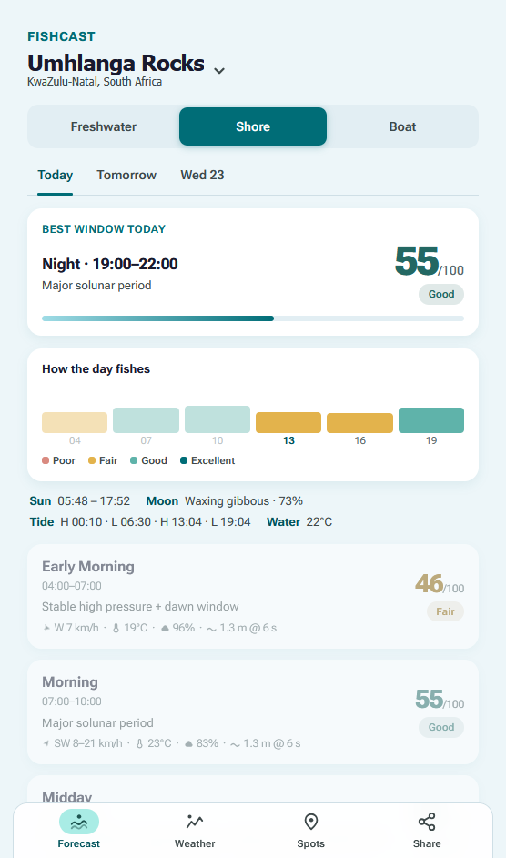

# FishCast

Deciding whether to go fishing used to mean checking a weather site, a tide
site, a solunar table and the wind, then guessing. FishCast is the one screen I
wanted instead. Pick a spot, anywhere on Earth, and it scores six fixed blocks
of the day (Early Morning 4 to 7, through Night 19 to 22, always in that spot's
local time). Each block gets a 0 to 100 score, a Poor / Fair / Good / Excellent
label, and one line saying why. It defaults to the Durban coast but works the
same for a dam in Gauteng or a beach in Portugal.

Live at https://chris-db.github.io/FishCast/



It's a static site. No build step, no API keys, nothing to sign up for. To run
it locally, serve the folder and open it:

```
python -m http.server 8140 --directory .
```

## How the scoring works

One engine in `js/engine.js`, and one config object per fishing mode. The
weights came from reading a lot of solunar and barometer folklore and then
adjusting until the scores matched what the good days actually looked like.
They're opinions, not physics.

| Factor | Shore | Freshwater | Boat |
|---|---|---|---|
| Solunar (moon transit within 1h is major, moonrise/set within 30min is minor) | 30% | 40% | 38% |
| Pressure trend (change over 4h, falling is best) | 25% | 35% | 31% |
| Tide (moving beats slack, last 2h of the push to high is best) | 20% | none | none |
| Dawn/dusk (within 1h of sunrise or sunset) | 15% | 15% | 19% |
| Moon phase (new and full amplify the solunar score) | 10% | 10% | 12% |

That weighted score then gets multiplied by a weather gate between 1.0 and 0.
Wind, gusts, rain, temperature extremes, lightning (a thunderstorm weather code
or high CAPE) and, for shore, swell height all pull it down. Freshwater treats
light rain as a small bonus because it often is one.

Boat mode adds a hard go/no-go on swell height, swell steepness and wind. If
that trips, the block reads "Don't launch" no matter what the score says. Boat
mode also prints a weather window line, something like "Good until 11:00, wind
picks up after", because that's the actual question when you're standing at
the slipway.

Inland spots have no tide data. When that happens the tide weight gets split
between pressure and solunar and the app tells you it did that.

## Where the data comes from

Open-Meteo, for everything. Their forecast API gives pressure, wind, gusts,
direction, rain amount and probability, temperature, cloud cover and CAPE. The
marine API gives swell, sea surface temperature and `sea_level_height_msl`,
which I use as a global tide signal. It's a model, not a tide table. Check the
real tables before you launch a boat on it. Their geocoding API handles spot
search. Sunrise, sunset, moonrise, moonset and moon transits are computed in
the browser in `js/astro.js`, so those cost no API calls at all.

Forecast responses are cached in localStorage for 30 minutes and marine
responses for 3 hours, and the app serves the stale copy if you're offline.
Every bit of time math uses the spot's timezone from the API, never the phone's
clock, which matters when you're planning a trip somewhere else. Saved spots,
the mode you picked for each spot, and your units all persist locally.

It's an installable PWA (`manifest.webmanifest` plus `sw.js` caching the static
shell), so on a phone it opens like an app and works with no signal.

## License

MIT, see [LICENSE](LICENSE).
